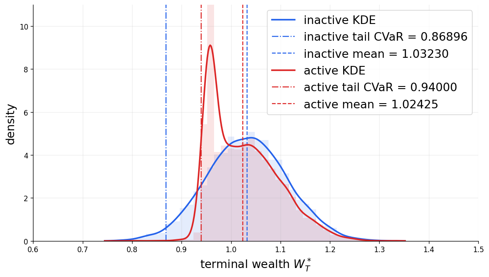
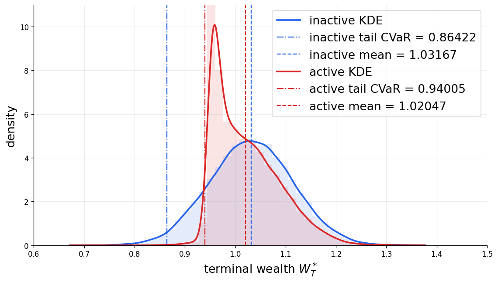
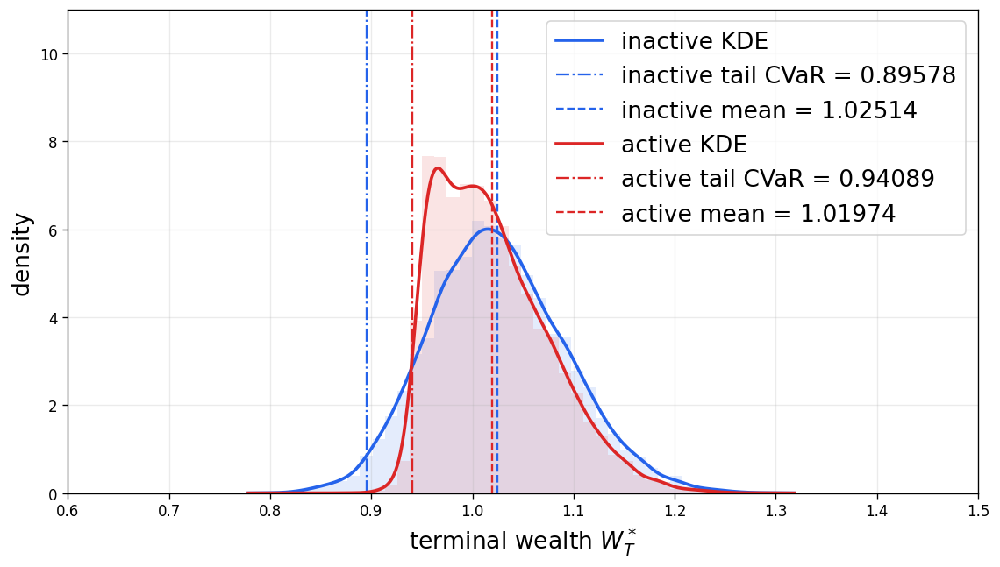
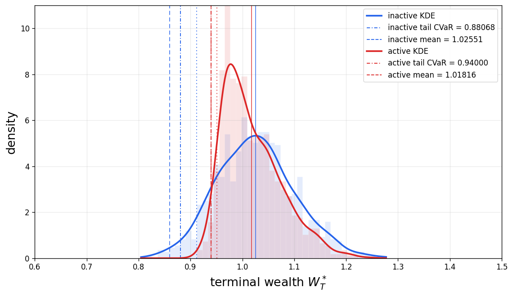

# Dynamic Portfolio Optimization under CVaR Constraints

## Repository contents

| File | Experiment |
|---|---|
| [`Complete_Market_Plots.ipynb`](Complete_Market_Plots.ipynb) | Complete-market benchmark with wealth as the HJB state and dollar risky exposure as the control. |
| [`Incomplete_Market_Plots.ipynb`](Incomplete_Market_Plots.ipynb) | Incomplete-market benchmark with an independent, nontraded endowment shock. |
| [`Linear_Control_Dynamics_Plots.ipynb`](Linear_Control_Dynamics_Plots.ipynb) | Two-state HJB model with quadratic trading-rate regularization. |
| [`Square_Root_Impact_Plots.ipynb`](Square_Root_Impact_Plots.ipynb) | Two-state HJB model with square-root execution-price impact. |
| [`figures/`](figures/) | Stored summary figures used by the project webpage and README. |
| [`index.html`](index.html) | Standalone project webpage. |
| [`requirements.txt`](requirements.txt) | Minimal local Python environment. |

## Model and notation

Terminal loss is defined by

$$
L_T=-W_T,
$$

and the risk constraint is

$$
\mathrm{CVaR}_{\alpha}(L_T)\le c,
\qquad \alpha=0.95.
$$

All result tables below use the terminal-loss convention.
The empirical feasibility residual is

$$
\mathrm{CVaR}_{\alpha}(-W_T)-c,
$$

so a nonpositive residual is feasible.
We use **nonbinding** for the case $c=-0.86$ and **binding** for the case $c=-0.94$.
The notebook dictionaries retain the legacy keys **inactive** and **active**, respectively, for backward compatibility.

### Direct-exposure benchmarks

In the complete- and incomplete-market experiments, $\varphi_t$ denotes dollar risky exposure and

$$
dW_t
=\varphi_t(\mu\,dt+\sigma\,dB_t)
+\beta^{\perp}dB_t^{\perp}.
$$

The complete-market case sets $\beta^{\perp}=0$, whereas the incomplete-market case sets $\beta^{\perp}=0.02$ with $B^{\perp}$ independent of $B$.
The objective is

$$
J(\varphi)
=\mathbb E\!\left[
\int_0^T
\left{
\frac{\gamma}{2}\left[(\sigma\varphi_t)^2+(\beta^{\perp})^2\right]
-\mu\varphi_t
\right}dt
\right].
$$

### Dynamic portfolio adjustment

Let $\theta_t$ denote the number of shares and define

$$
\varphi_t=\theta_tS_t,
\qquad
\dot\varphi_t=\dot\theta_tS_t.
$$

Thus, $\varphi_t$ is dollar risky exposure and $\dot\varphi_t$ is the signed dollar trading-rate control.
The dot labels the control and is not the ordinary time derivative of the diffusion $\varphi_t$.
The exposure state evolves as

$$
d\varphi_t
=\dot\varphi_t\,dt
+\varphi_t(\mu\,dt+\sigma\,dB_t).
$$

The two portfolio-adjustment experiments have different economic interpretations.

- **Quadratic regularization:** $\Lambda\dot\varphi_t^2/2$, with $\Lambda=0.01$, is an objective regularizer that smooths adjustment.
  It is not a cash execution cost and is not deducted from wealth.
- **Square-root price impact:** execution cost is proportional to $|\dot\varphi_t|^{3/2}$, with $\Lambda_{3/2}=0.004472135955$.
  It changes the execution price and is deducted from wealth.

## Reproducibility protocol

The notebooks separate policy selection from final evaluation.

1. The HJB policy and CVaR parameters are selected using the search sample.
2. Where indicated below, an independent calibration or holdout sample is used to check feasibility and choose a small numerical safety buffer.
3. The policy, threshold, and multiplier are then frozen.
4. A fresh 50,000-path sample is generated for the final out-of-sample (OOS) table and distributional figures.

No final OOS path is used to select the reported policy, threshold, or multiplier.

### Search, validation, and final evaluation

| Experiment | Search sample | Additional validation before freezing | Final OOS sample | Final OOS seed |
|---|---:|---:|---:|---:|
| Complete market | 5,000 | 50,000-path calibration validation, seed `900013` | 50,000 | `1900013` |
| Incomplete market | 5,000, plus 20,000-path search holdout | 50,000-path calibration validation, seed `900013` | 50,000 | `1900013` |
| Quadratic regularization | 10,000 | 20 tuning seeds and 20 untouched holdout seeds, 10,000 paths per seed | 50,000 | `1900013` |
| Square-root impact | 1,000 | None; the full nested search is run on the search sample | 50,000 | `900013` |

For the incomplete-market search holdout, the stored seed is `686035552`.
For quadratic regularization, tuning seeds are `101`--`120` and holdout seeds are `201`--`220`.
All 40 quadratic-regularization validation runs are feasible; the least conservative loss CVaR is `-0.9400076101`.

### Numerical resolution

| Experiment | Time steps | HJB state grid | Control resolution | $\eta$ tolerance | $\lambda$ tolerance | CVaR residual tolerance | Maximum $\eta/\lambda$ iterations |
|---|---:|---:|---|---:|---:|---:|---:|
| Complete market | 100 | 201 points in $W$ | Bounded dollar exposure on $[-2,2]$; analytic quadratic minimization | $10^{-5}$ | $10^{-5}$ | $10^{-5}$ | 100 / 24 |
| Incomplete market | 100 | 201 nonuniform points in $W$, concentrated near $W=-\eta$ | Bounded dollar exposure; policy capped at the Merton exposure | $5\times10^{-4}$ | $10^{-6}$ | $10^{-5}$ | 40 / 20 |
| Quadratic regularization | 320 | $161\times193$ in $(W,\varphi)$ | Trading rate in $[-2,2]$ | $5\times10^{-4}$ | $10^{-4}$ | $10^{-4}$ | tolerance based / 12 |
| Square-root impact | 200 | $80\times100$ in $(W,\varphi)$ | 167 rates: spacing $0.01$ on $[-0.75,0.75]$, with sparse tails to $[-4,4]$ | $10^{-5}$ | $10^{-7}$ | $10^{-6}$ | 32 / 32 |

The complete-market wealth grid is constructed from pilot simulations.
The incomplete-market grid is nonuniform because the terminal CVaR penalty has a kink near $W=-\eta$.
The two portfolio-adjustment experiments solve a two-dimensional HJB equation in wealth and dollar risky exposure.

## Common calibration

| Parameter | Symbol | Value |
|---|---:|---:|
| Horizon | $T$ | 1 |
| Initial wealth | $W_0$ | 1 |
| Risk-free rate | $r$ | 0 |
| Risky-asset drift | $\mu$ | 0.08 |
| Risky-asset volatility | $\sigma$ | 0.20 |
| Risk aversion | $\gamma$ | 5 |
| CVaR confidence level | $\alpha$ | 0.95 |
| Nonbinding CVaR limit | $c$ | -0.86 |
| Binding CVaR limit | $c$ | -0.94 |
| Merton dollar exposure | $\mu/(\gamma\sigma^2)$ | 0.40 |

## Final out-of-sample results

The following values are computed only after the relevant policy and calibration parameters have been frozen.

| Experiment | Case | $c$ | $\widehat\lambda$ | Loss CVaR | $\mathbb E[W_T]$ | Average exposure | Feasibility residual |
|---|---|---:|---:|---:|---:|---:|---:|
| Complete market | Nonbinding | -0.86 | 0 | -0.8671 | 1.0322 | 0.4000 | $-7.1\times10^{-3}$ |
| Complete market | Binding | -0.94 | 0.0720 | -0.9406 | 1.0242 | 0.2981 | $-6.13\times10^{-4}$ |
| Incomplete market | Nonbinding | -0.86 | 0 | -0.8620 | 1.0322 | 0.4000 | $-2.0\times10^{-3}$ |
| Incomplete market | Binding | -0.94 | 0.1400 | -0.9405 | 1.0206 | 0.2549 | $-4.88\times10^{-4}$ |
| Quadratic regularization | Nonbinding | -0.86 | 0 | -0.8971 | 1.0247 | 0.3104 | $-3.71\times10^{-2}$ |
| Quadratic regularization | Binding | -0.94 | 0.06001 | -0.9413 | 1.0192 | 0.2415 | $-1.26\times10^{-3}$ |
| Square-root impact | Nonbinding | -0.86 | 0 | -0.8839 | 1.0260 | 0.3500 | $-2.39\times10^{-2}$ |
| Square-root impact | Binding | -0.94 | 0.07818 | -0.9409 | 1.0180 | 0.2422 | $-8.84\times10^{-4}$ |

In the direct-exposure experiments, average exposure is the sample--time average of the simulated dollar-exposure control over all paths and decision dates.
In the portfolio-adjustment experiments, it is the sample--time average of the exposure state over all paths and stored dates.
Fresh Monte Carlo runs will exhibit ordinary sampling variation.

## Running the notebooks

### Google Colab

Upload a notebook to Google Colab and select **Runtime > Run all**.
The saved outputs can be inspected without rerunning the expensive search cells.

### Local installation

Python 3.10 or later is recommended.

```bash
git clone https://github.com/xf-shi/Dynamic-Portfolio-under-CVaR.git
cd Dynamic-Portfolio-under-CVaR
python -m venv .venv
```

On Windows PowerShell:

```powershell
.venv\Scripts\Activate.ps1
pip install -r requirements.txt
jupyter lab
```

On macOS or Linux:

```bash
source .venv/bin/activate
pip install -r requirements.txt
jupyter lab
```

The complete-, incomplete-, and quadratic-regularization notebooks default to stored, validation-buffered calibration parameters for a faster OOS rerun.
Set `RUN_FULL_SEARCH=True` to repeat their full nested search.
The square-root-impact notebook uses `RUN_FULL_OUTER_SEARCH=True` by default and therefore repeats the nested search before final OOS evaluation.

The two-state HJB notebooks are substantially more computationally intensive than the wealth-only benchmarks.
Run the notebooks from top to bottom because later plotting cells use policies and OOS samples created by earlier cells.

## Stored figures

<p align="center">
  
  
</p>
<p align="center">
  
  
</p>
